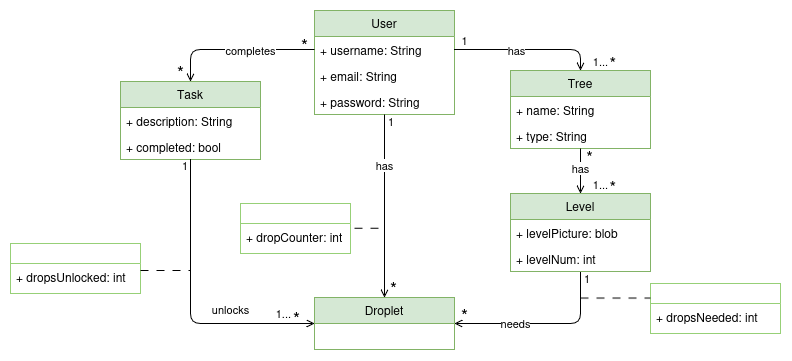
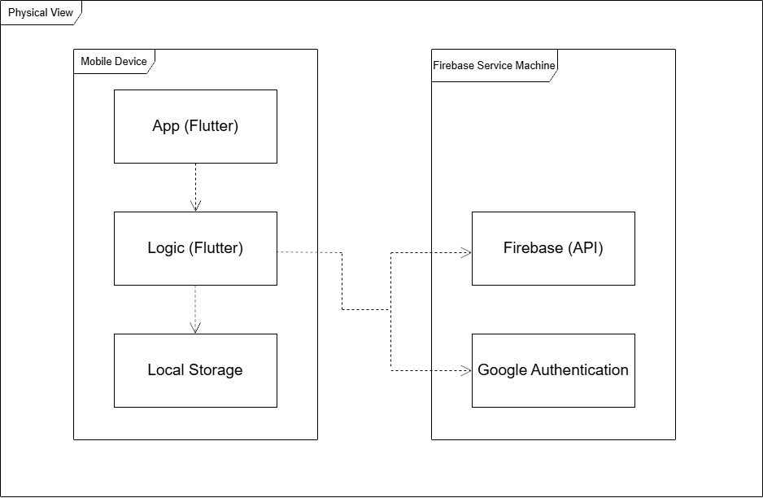

<!-- Template file for README.md for LEIC-ES-2023-24 -->

> [!NOTE] In this file, you’ll find the structure you should follow to document your mobile app in the README.md file for LEIC-ES-2024-25. It’s a single file with guidelines. You can add more sections, but for assessment normalisation and automation, include all sections of this template. Your professors will clarify about specificities of your app.

# *GreenDrop* Development Report

Welcome to the documentation pages of _GreenDrop_!

This Software Development Report, tailored for LEIC-ES-2024-25, provides comprehensive details about _GreenDrop_, from high-level vision to low-level implementation decisions. It’s organised by the following activities. 

* [Business modeling](#Business-Modelling) 
  * [Product Vision](#Product-Vision)
  * [Features and Assumptions](#Features-and-Assumptions)
  * [Elevator Pitch](#Elevator-pitch)
* [Requirements](#Requirements)
  * [User stories](#User-stories)
  * [Domain model](#Domain-model)
* [Architecture and Design](#Architecture-And-Design)
  * [Logical architecture](#Logical-Architecture)
  * [Physical architecture](#Physical-Architecture)
  * [Vertical prototype](#Vertical-Prototype)
* [Project management](#Project-Management)
  * [Sprint 0](#Sprint-0)
  * [Sprint 1](#Sprint-1)
  * [Sprint 2](#Sprint-2)
  * [Sprint 3](#Sprint-3)
  * [Sprint 4](#Sprint-4)
  * [Final Release](#Final-Release)

Contributions are expected to be made exclusively by the initial team, but we may open them to the community, after the course, in all areas and topics: requirements, technologies, development, experimentation, testing, etc.

Please contact us!

Thank you!

* Carolina Ferreira (up202303547@up.pt)
* Constança Ferreira (up202306850@up.pt)
* Francisco Tomaz (up202309456@up.pt)
* Maria Inês Pinho (up202306659@up.pt)
* Narciso Barroso (up202305431@up.pt)
> 2LEIC03T3 - ES 2024/25
---
## Business Modelling

Business modeling in software development involves defining the product's vision, understanding market needs, aligning features with user expectations, and setting the groundwork for strategic planning and execution.

### Product Vision

<!-- 
Start by defining a clear and concise vision for your app, to help members of the team, contributors, and users into focusing their often disparate views into a concise, visual, and short textual form. 

The vision should provide a "high concept" of the product for marketers, developers, and managers.

A product vision describes the essential of the product and sets the direction to where a product is headed, and what the product will deliver in the future. 

**We favor a catchy and concise statement, ideally one sentence.**

We suggest you use the product vision template described in the following link:
* [How To Create A Convincing Product Vision To Guide Your Team, by uxstudioteam.com](https://uxstudioteam.com/ux-blog/product-vision/)

To learn more about how to write a good product vision, please see:
* [Vision, by scrumbook.org](http://scrumbook.org/value-stream/vision.html)
* [Product Management: Product Vision, by ProductPlan](https://www.productplan.com/glossary/product-vision/)
* [How to write a vision, by dummies.com](https://www.dummies.com/business/marketing/branding/how-to-write-vision-and-mission-statements-for-your-brand/)
* [20 Inspiring Vision Statement Examples (2019 Updated), by lifehack.org](https://www.lifehack.org/articles/work/20-sample-vision-statement-for-the-new-startup.html)
-->

Our app promotes the completion of eco-friendly tasks so that users earn water droplets used to maintain and grow their own virtual trees.

### Features and Assumptions
<!-- 
Indicate an  initial/tentative list of high-level features - high-level capabilities or desired services of the system that are necessary to deliver benefits to the users.
 - Feature XPTO - a few words to briefly describe the feature
 - Feature ABCD - ...
...

Optionally, indicate an initial/tentative list of assumptions that you are doing about the app and dependencies of the app to other systems.
-->

### Elevator Pitch
<!-- 
Draft a small text to help you quickly introduce and describe your product in a short time (lift travel time ~90 seconds) and a few words (~800 characters), a technique usually known as elevator pitch.

Take a look at the following links to learn some techniques:
* [Crafting an Elevator Pitch](https://www.mindtools.com/pages/article/elevator-pitch.htm)
* [The Best Elevator Pitch Examples, Templates, and Tactics - A Guide to Writing an Unforgettable Elevator Speech, by strategypeak.com](https://strategypeak.com/elevator-pitch-examples/)
* [Top 7 Killer Elevator Pitch Examples, by toggl.com](https://blog.toggl.com/elevator-pitch-examples/)
-->

Imagine turning your everyday green actions into a fun, rewarding experience.

With GreenDrop, the app that makes sustainability engaging and interactive, it is possible. Every time you recycle, reduce waste, save water and more, you earn water droplets. Use them to grow and nurture virtual trees, building your own lush forest while making a real-world impact.

With challenges, rewards, and a community of eco-conscious users, GreenDrop transforms small daily habits into a movement for a greener future.
In GreenDrop, every small action counts. Watch your tree flourish as you build healthier habits for yourself and a brighter future for the planet!

## Requirements

### User Stories
<!-- 
In this section, you should describe all kinds of requirements for your module: functional and non-functional requirements.

For LEIC-ES-2024-25, the requirements will be gathered and documented as user stories. 

Please add in this section a concise summary of all the user stories.

**User stories as GitHub Project Items**
The user stories themselves should be created and described as items in your GitHub Project with the label "user story". 

A user story is a description of a desired functionality told from the perspective of the user or customer. A starting template for the description of a user story is *As a < user role >, I want < goal > so that < reason >.*

Name the item with either the full user story or a shorter name. In the “comments” field, add relevant notes, mockup images, and acceptance test scenarios, linking to the acceptance test in Gherkin when available, and finally estimate value and effort.

**INVEST in good user stories**. 
You may add more details after, but the shorter and complete, the better. In order to decide if the user story is good, please follow the [INVEST guidelines](https://xp123.com/articles/invest-in-good-stories-and-smart-tasks/).

**User interface mockups**.
After the user story text, you should add a draft of the corresponding user interfaces, a simple mockup or draft, if applicable.

**Acceptance tests**.
For each user story you should write also the acceptance tests (textually in [Gherkin](https://cucumber.io/docs/gherkin/reference/)), i.e., a description of scenarios (situations) that will help to confirm that the system satisfies the requirements addressed by the user story.

**Value and effort**.
At the end, it is good to add a rough indication of the value of the user story to the customers (e.g. [MoSCoW](https://en.wikipedia.org/wiki/MoSCoW_method) method) and the team should add an estimation of the effort to implement it, for example, using points in a kind-of-a Fibonnacci scale (1,2,3,5,8,13,20,40, no idea).

-->

<code>
<a href="https://github.com/LEIC-ES-2024-25/2LEIC03T3/issues/3#issue-2905574560" style="color: white;">
  As a User I want to be able to access a set of eco-friendly tasks/goals for the day so that I try to lead a greener lifestyle.
</a>
</code>
 
<code>
<a href="https://github.com/LEIC-ES-2024-25/2LEIC03T3/issues/4#issue-2905605119" style="color:white;">
  As a User I want to be able to checkmark which tasks I have completed so that I can earn droplets for each fulfilled task.
</a>
</code>
 
<code>
<a href="https://github.com/LEIC-ES-2024-25/2LEIC03T3/issues/2#issue-2905572703" style="color: white;">
  As a User I want to be able to see how many droplets of water I have so that I can water my tree.
</a>
</code>
 
<code>
<a href="https://github.com/LEIC-ES-2024-25/2LEIC03T3/issues/1#issue-2905572272" style="color: white;">
  As a User I want to be able to water my virtual tree so that it doesn't perish.
</a>
</code>
 
<a href=https://github.com/orgs/LEIC-ES-2024-25/projects/64/views/1>
  read more...
</a>

### Domain model

<!-- 
To better understand the context of the software system, it is useful to have a simple UML class diagram with all and only the key concepts (names, attributes) and relationships involved of the problem domain addressed by your app. 
Also provide a short textual description of each concept (domain class). 

Example:
 

  

-->

  

Our app gives users the opportunity to grow their own virtual garden by doing eco-friendly activities. Each activity earns them droplets that can be used to grow and buy trees.

User - Stores user information (username, password and email). 
Task - User's daily goal is to complete tasks so they can earn droplets. Each task, when markchecked provides one to many droplets. 
Tree - Stores the name and type of the trees the user owns. Each user can have many trees in addition to the one he starts with. 
Level - Keeps track of the current level of a tree and stores the visual representation of it in that specific level 
Droplet - It's the "currency" of the app, allows the user to upgrade and buy trees

## Architecture and Design
<!--
The architecture of a software system encompasses the set of key decisions about its organization. 

A well written architecture document is brief and reduces the amount of time it takes new programmers to a project to understand the code to feel able to make modifications and enhancements.

To document the architecture requires describing the decomposition of the system in their parts (high-level components) and the key behaviors and collaborations between them. 

In this section you should start by briefly describing the components of the project and their interrelations. You should describe how you solved typical problems you may have encountered, pointing to well-known architectural and design patterns, if applicable.
-->

### Logical architecture
<!--
The purpose of this subsection is to document the high-level logical structure of the code (Logical View), using a UML diagram with logical packages, without the worry of allocating to components, processes or machines.

It can be beneficial to present the system in a horizontal decomposition, defining layers and implementation concepts, such as the user interface, business logic and concepts.

Example of _UML package diagram_ showing a _logical view_ of the Eletronic Ticketing System (to be accompanied by a short description of each package):

-->

  

The application contains the User Interface, the pages the user interacts with. Which communicates with the Business Logic, that manipulates and manages user Data. The Firebase Database stores information about the app. Google Account is used to log into the application.

### Physical architecture
<!--
The goal of this subsection is to document the high-level physical structure of the software system (machines, connections, software components installed, and their dependencies) using UML deployment diagrams (Deployment View) or component diagrams (Implementation View), separate or integrated, showing the physical structure of the system.

It should describe also the technologies considered and justify the selections made. Examples of technologies relevant for ESOF are, for example, frameworks for mobile applications (such as Flutter).

Example of _UML deployment diagram_ showing a _deployment view_ of the Eletronic Ticketing System (please notice that, instead of software components, one should represent their physical/executable manifestations for deployment, called artifacts in UML; the diagram should be accompanied by a short description of each node and artifact):

-->

  

Following the Logical Architecture, maintaining the same dependencies, we can develop the Physical Architecture. The Mobile Device contains the Flutter Application, Logic and Local Storage. The Firebase Service contains the Firebase (API).
<!--The Firebase Service not only contains the Firebase (API), but also allows storage of user’s information with Google Authentication.-->

### Vertical prototype
<!--
To help on validating all the architectural, design and technological decisions made, we usually implement a vertical prototype, a thin vertical slice of the system integrating as much technologies we can.

In this subsection please describe which feature, or part of it, you have implemented, and how, together with a snapshot of the user interface, if applicable.

At this phase, instead of a complete user story, you can simply implement a small part of a feature that demonstrates thay you can use the technology, for example, show a screen with the app credits (name and authors).
-->

  

## Project management
<!--
Software project management is the art and science of planning and leading software projects, in which software projects are planned, implemented, monitored and controlled.

In the context of ESOF, we recommend each team to adopt a set of project management practices and tools capable of registering tasks, assigning tasks to team members, adding estimations to tasks, monitor tasks progress, and therefore being able to track their projects.

Common practices of managing agile software development with Scrum are: backlog management, release management, estimation, Sprint planning, Sprint development, acceptance tests, and Sprint retrospectives.

You can find below information and references related with the project management: 

* Backlog management: Product backlog and Sprint backlog in a [Github Projects board](https://github.com/orgs/FEUP-LEIC-ES-2023-24/projects/64);
* Release management: [v0](#), v1, v2, v3, ...;
* Sprint planning and retrospectives: 
  * plans: screenshots of Github Projects board at begin and end of each Sprint;
  * retrospectives: meeting notes in a document in the repository, addressing the following questions:
    * Did well: things we did well and should continue;
    * Do differently: things we should do differently and how;
    * Puzzles: things we don’t know yet if they are right or wrong… 
    * list of a few improvements to implement next Sprint;

-->

### Sprint 0

### Sprint 1

### Sprint 2

### Sprint 3

### Sprint 4

### Final Release